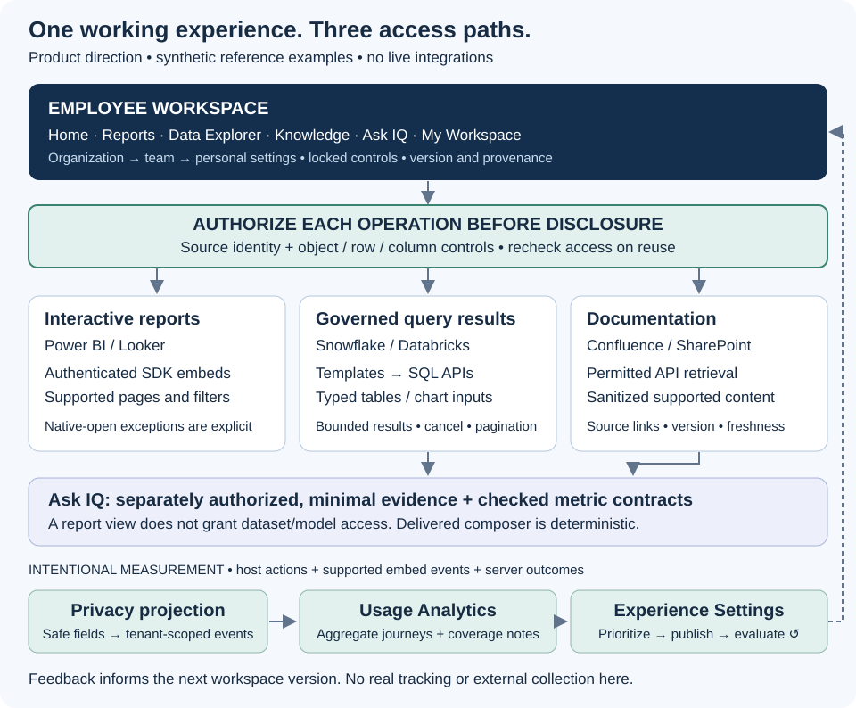

# 🧠 Enterprise IQ™
### Unified Enterprise Analytics & Intelligence Platform

**One workspace to view reports, query data, and understand the business.**

Enterprise IQ's product vision brings interactive analytics, governed queries, documentation, and AI-assisted investigation into one customizable enterprise experience. A shared event model helps organizations understand how that experience is used and where it can improve.

**McHenry Power · Enterprise Analytics & Product Engineering**<br>
**This repository:** Public reference architecture and executable synthetic examples. Live enterprise integrations are not deployed here.

[User experience](docs/product-vision.md) · [Customization](docs/experience-and-customization.md) · [Journey analytics](docs/journey-telemetry.md) · [Architecture](docs/architecture.md) · [Run examples](#run-and-inspect)

---

## 🧭 Work in one place

An employee needs to investigate a number, not assemble a tour of vendor portals. Finding a report is only the beginning: they need to interact with it, inspect its definition, query supporting records, and understand the explanation. Enterprise IQ proposes a workspace where that work can happen together, preserving source access and useful report capabilities.

The default navigation follows tasks: **Home · Reports · Data Explorer · Knowledge · Ask IQ · My Workspace**. A report occupies the main surface, with expand/fullscreen controls and definitions, documentation, freshness, ownership, and Ask IQ available on demand. Native opening remains an explicit exception when the source cannot support an in-platform task.

| Pillar | Concrete product direction |
| --- | --- |
| **Use** | Open an authorized Finance report, adjust a supported slicer, then inspect a credits table from an approved query. |
| **Customize** | Finance starts with close reports and definitions; Sales starts with its report collection and commercial guidance. Personal favorites respect organization locks and access policy. |
| **Improve** | Inspect aggregate search friction, revise department terminology, publish a configuration version, and compare subsequent observed journeys. |

**Customize the experience. Understand the journey. Improve how people work.** Experience Settings and Usage Analytics belong in administration, separate from ordinary employee navigation. AI supports the broader experience through a proposed custom LLM-powered application using selected authorized context; this is not foundation-model training.

## 🔎 Do the work, then improve the workspace

In the fictional Aster Manufacturing example, an employee opens Finance, finds and interacts with a Power BI report, reads the revenue definition, runs a permitted credits query, views its table, consults the close note, asks IQ, and saves the investigation. These are optional, connected steps; people can revisit earlier work.

Finance shows **$1,840,000 net revenue**; Sales shows **$2,000,000 gross revenue**. After aligning September 2026, USD, US entity, monthly grain, posted transactions, aggregation, definition versions, freshness, and provenance, synthetic credit rows explain:

**$2,000,000 − $160,000 = $1,840,000.**

The existing deterministic composer verifies that explanation and withholds it when evidence is missing, stale, incompatible, or inaccessible. The new CLI resolves a department configuration, executes a mock governed query, and emits a sanitized journey. It demonstrates local behavior, not an embedded application or live LLM.

An administrator could then inspect recurring zero-result searches, adjust approved navigation or guidance, publish a new experience version, and review subsequent paths. Before/after differences are descriptive associations, not causal productivity claims. A report rendering does not prove understanding; a native-open handoff does not establish failure. [Follow both journeys](docs/walkthrough.md).

---

## 🏗️ Experience, access, and feedback



[Open the architecture at full resolution](diagrams/enterprise-workspace.svg). [Explore the experience feedback loop](docs/experience-and-customization.md#experience-feedback-loop).

| Source targets | In-platform task | Important boundary |
| --- | --- | --- |
| Power BI / Looker | Supported authenticated report/dashboard interactions | SDK capabilities, source permissions, licensing, and instance settings apply. |
| Snowflake / Databricks | Approved queries returning typed tables and permitted chart inputs | API execution with separate identity, policy, resource limits, and result handling. |
| Confluence / SharePoint | Permitted definitions and documentation with provenance | Sanitized supported content; native opening for unsupported content/functions. |

These are **target adapters, not connected integrations**. The [source matrix](docs/source-adapters.md) separates product intention, documented mechanisms, local examples, and live verification. [Official references](docs/references.md) record review dates and unresolved deployment questions.

Viewing, querying, and model context are distinct access decisions. Shared context does not require copying all source data or sending everything to a model. Permission checks precede titles, snippets, result rows, citations, and context assembly, and recur before reuse.

Journey measurement combines host actions, supported embed events, and server outcomes. The reference projects allowlisted fields, rejects spoofed simulated messages, distinguishes recurring renders, and calculates metrics with missing-observation and cohort rules. There is no Google tag, analytics service, or actual employee/visitor tracking.

---

## Run and inspect

Use **Node.js 24 or later** from the repository root. The examples use only the standard library and built-in test runner; no installation, credentials, or network is required.

```sh
node --test
node examples/working-experience.mjs
node examples/evidence-composer.mjs restricted
```

[Example instructions](examples/README.md) explain inputs and outputs. [Validation and roadmap](docs/validation-and-roadmap.md) records executed checks and integration gates.

| Inspectable decision | Reference |
| --- | --- |
| Configuration changes presentation, never entitlements | [Resolver and provenance](examples/experience-configuration.mjs) |
| Approved query templates, bounded results, fresh paging/export authorization | [Query session](examples/governed-query.mjs) |
| Analytics retains safe events and incomplete coverage | [Journey contract and metrics](docs/journey-telemetry.md) |
| Numerical conclusions require compatible, permitted evidence | [Metric contract](examples/metric-contract.mjs), [permission design](docs/intelligence-and-permissions.md) |

## Scope, contribution, and next steps

**Delivered:** Independently authored architecture, original diagrams, synthetic walkthroughs, six executable reference patterns, and tests that vary data, permissions, configuration, and event delivery.

**Reference limits:** Synthetic trust contexts do not establish enterprise authentication or isolation. The composer is deterministic. Live adapters, UI, model inference, scale validation, compliance certification, and measured business outcomes are outside this release.

**Next integration work:** Validate one source and identity path, build the workspace and configuration lifecycle, verify source-enforced policies, evaluate model answers, and approve privacy controls before collecting real telemetry. No live demo is published.

Contributions should preserve the [public boundaries](AGENTS.md), include reproducible evidence, and explain changed behavior. This public work makes no claim to an employer's implementation. Contact [McHenry Power on LinkedIn](https://www.linkedin.com/in/mchenry-j-power-mba).
