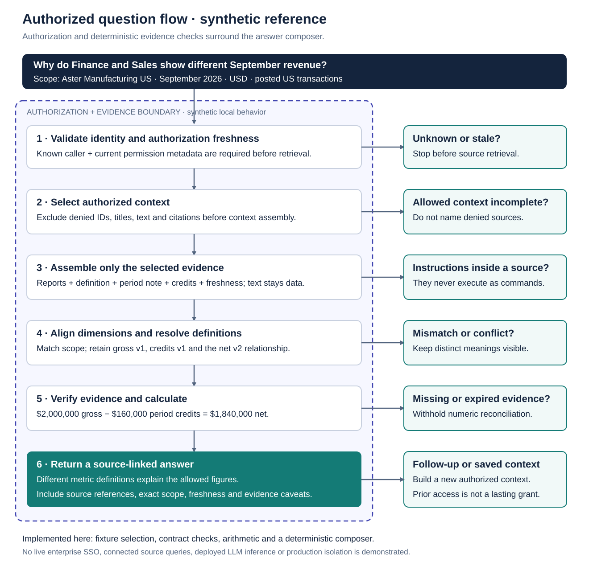

# 🧠 Enterprise IQ™
### Unified Enterprise Analytics & Intelligence Platform

**Find the report. Understand the metric. Ask across the business.**

Enterprise IQ brings analytics discovery, business documentation, and source-grounded questions into one enterprise workspace. Its reference architecture connects the experience across BI, data, and knowledge systems while preserving source ownership and access boundaries.

**McHenry Power · Enterprise Analytics · Product Engineering · AI Systems**<br>
**This repository:** Public reference architecture and tested synthetic examples. No live connectors, enterprise SSO, production authorization, or deployed model inference.<br>
**Target platforms:** Power BI · Looker · Snowflake · Databricks · Confluence · SharePoint.

[Walkthrough](docs/walkthrough.md) · [Architecture](docs/architecture.md) · [Intelligence & permissions](docs/intelligence-and-permissions.md) · [Run the examples](#run-and-inspect)

---

## 🔗 The business problem

An employee wants an answer, not a tour of vendor portals. A report lives in one system, its metric definition in another, and the close procedure somewhere else. Finding a plausible chart is only the beginning: the employee still needs its owner, reporting period, freshness, and supporting context.

Enterprise IQ proposes a shared starting point for that investigation. Analytics remain with their authoritative platforms; approved metadata and documentation connect them. The workspace helps people discover what they may access, understand what a number means, and ask a scoped question with inspectable evidence. It does not require copying every enterprise dataset into a new database.

The [product vision](docs/product-vision.md) organizes this experience around **Home, Analytics Catalog, Knowledge, Ask IQ, and My Workspace**. A report workspace pairs a primary viewing surface with definitions, related documentation, and lineage on demand. Administration sits separately from employee navigation. Personal collections save useful starting points; every later retrieval still needs fresh authorization.

## 🔎 One question, several systems

**“Why do Finance and Sales show different September revenue?”**

In the fictional Aster Manufacturing scenario, Finance shows **$1,840,000 net revenue**, while Sales shows **$2,000,000 gross revenue**. Synthetic credit records total **$160,000**. A definition specifies which credits reduce gross revenue; a close note places those credits in September; refresh evidence identifies the completed data version.

The example aligns September 2026, USD, the US entity, monthly entity grain, posted US transactions, and sum aggregation before calculating:

**$2,000,000 − $160,000 = $1,840,000.**

The supported explanation is different definitions, not a broken pipeline. Before, an employee locates reports, definitions, and close evidence separately. In the proposed workspace, one scoped investigation connects those permitted sources. This is a user journey, not a measured productivity claim.

The [full walkthrough](docs/walkthrough.md) follows all six synthetic source roles. Executable variations withhold the reconciliation when refresh evidence is stale, definitions conflict, credits are missing, or permitted context is insufficient. An unavailable source is never identified through a hidden title or citation.

---

## 🧭 How the platform fits together


[Open the diagram at full resolution](diagrams/enterprise-workspace.svg).

**Access** discovers authorized assets and opens reports through supported authenticated viewing or a native link. Report viewing does not grant underlying-data export or model access.

**Context** connects metric contracts, documentation, owners, versions, and freshness. Permission filtering happens before titles, snippets, citations, or content enter the answer context.

**Intelligence** is the proposed custom LLM-powered intelligence layer. It combines only the selected evidence needed for a question. Approved structured plans obtain source-enforced results; deterministic checks verify the arithmetic. Embedded chart pixels are not a data interface. The delivered composer demonstrates these surrounding checks without running an LLM.

| Target systems | Intended role | Release status |
| --- | --- | --- |
| Power BI / Looker | Report discovery, supported viewing, separately authorized queries | Target adapters; not connected |
| Snowflake / Databricks | Governed structured data, metric metadata, available lineage | Target adapters; not connected |
| Confluence / SharePoint | Permitted definitions, procedures, and provenance | Target adapters; not connected |

The [adapter matrix](docs/source-adapters.md) explains identity, licensing, freshness, and API limitations for each platform, supported by [official references](docs/references.md).

<details>
<summary>Inspect the authorized question flow</summary>



[Open at full resolution](diagrams/authorized-question-flow.svg). [Read the permission design](docs/intelligence-and-permissions.md).

</details>

## Engineering decisions that matter

| Challenge | Approach | Inspect |
| --- | --- | --- |
| Access preservation | Fail closed; select context before composition; recheck on reuse | [Permission design](docs/intelligence-and-permissions.md), [selection example](examples/authorized-context.mjs) |
| Semantic consistency | Compare period, currency, entity, grain, filters, aggregation, and explicit definitions | [Metric contracts](examples/metric-contract.mjs) |
| Freshness and revocation | Separate source freshness from permission validity; reject stale evidence | [Tradeoffs](docs/architecture.md#decisions-and-their-costs), [tests](tests/) |
| Source attribution | Build references only from allowed evidence; retain definition and time context | [Evidence composer](examples/evidence-composer.mjs) |
| Supported viewing | Preserve native capabilities and open a native report when embedding is unsuitable | [Adapter matrix](docs/source-adapters.md) |

These choices favor an inspectable investigation over an unconstrained cross-platform query. Conflicting definitions retain their meanings; missing values never become zero. Production enforcement belongs outside the model and must preserve each source's relevant controls.

---

## Run and inspect

Use **Node.js 24 or later** from the repository root. The examples use JavaScript modules and the standard library only; no package installation, model key, or vendor tenant is required.

```sh
node --test
node examples/evidence-composer.mjs
node examples/evidence-composer.mjs restricted
node examples/evidence-composer.mjs conflicting-definitions
```

This runs three reference patterns: authorized context selection, metric compatibility and reconciliation, and deterministic evidence-bounded answer assembly. Outputs change with data and authorization inputs. [Example instructions](examples/README.md) cover every scenario; [validation and roadmap](docs/validation-and-roadmap.md) records executed checks and their limits.

## Current scope and contribution

**Delivered:** This independently authored architecture, original system diagrams, synthetic walkthrough, executable patterns, and tests. McHenry Power's public contribution centers on product thinking, semantic clarity, and inspectable engineering decisions.

**Reference-only:** Synthetic identities and permissions, fixture-based calculations, and a deterministic composer. Tests establish their local behavior; they do not validate enterprise isolation, live APIs, or model accuracy.

**Future integration:** Real identity and source adapters, governed query execution, supported report viewing, and evaluated model inference require separate implementation and validation. This work makes no claim to an employer's implementation or production results.

Contributions should preserve the [public boundaries and evidence rules](AGENTS.md), include a reproducible example, and explain the changed behavior. There is no published live demo or deployment in this release.

Contact [McHenry Power on LinkedIn](https://www.linkedin.com/in/mchenry-j-power-mba).
