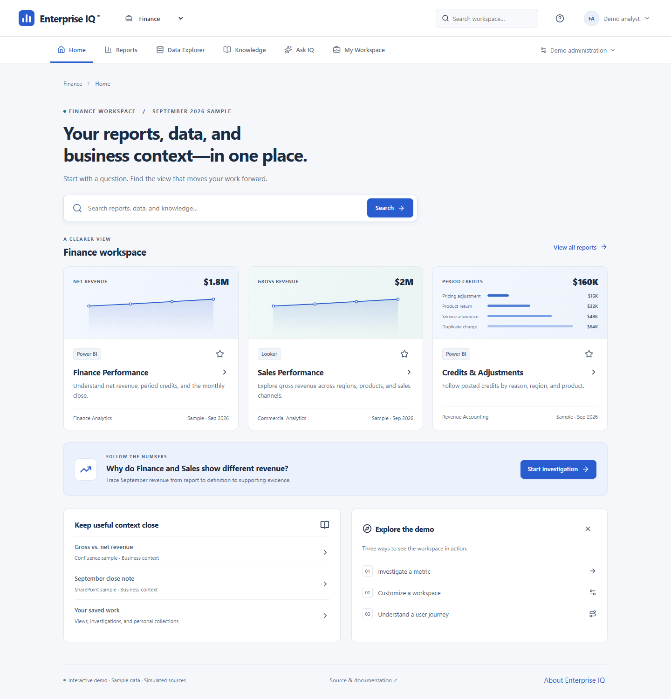

# 🧠 Enterprise IQ™
### Unified Enterprise Analytics & Intelligence Platform

**One workspace to view reports, query data, and understand the business.**

Enterprise IQ brings interactive reports, governed sample queries, and business context into a customizable workspace. Follow a number from its report to its definition, inspect supporting records, and save an evidence-based investigation.

**McHenry Power · Enterprise Analytics & Product Engineering**<br>
**Interactive reference demo · Sample data · Simulated sources**

**Live demo:** [Open Enterprise IQ](https://mchenry-power-dev.github.io/enterprise-iq/) · [Run locally](#run-and-inspect)

[Demo guide](docs/demo-guide.md) · [Gallery](docs/product-gallery.md) · [Architecture](docs/demo-architecture.md) · [Executable examples](examples/README.md) · [Validation](docs/demo-validation.md)



[Open the authentic application capture at full resolution](docs/images/demo/home.png). Screenshots show the working browser application with original synthetic records, not vendor embeds or generated interface mockups.

---

## 🧭 Work in one place

**Start with the task.** Home opens directly into Finance, with populated reports, search, useful definitions, and a revenue investigation. Employee navigation follows the work: Home, Reports, Data Explorer, Knowledge, Ask IQ, and My Workspace. A separate demo administration menu contains Experience Settings, Usage Analytics, and Source Directory.

**Use the reports.** Finance Performance and Sales Performance provide distinct analytical views. Change the reporting month, region, or product; the metrics, charts, and underlying tables update together. Select a chart bar to filter, switch report pages, inspect monthly values, enter focus view, or export the selected sample records. Credits, Regional Revenue, and Product Mix provide additional views of the same record set.

**Inspect the evidence.** Data Explorer runs approved templates through the existing governed query-session contract. Snowflake and Databricks sample adapters calculate typed results locally. SQL previews reflect parameters; results support sorting, paging, partial-output labels, fresh simulated permission checks, cancellation, retry, and scoped CSV export. No arbitrary SQL or warehouse connection is implied.

**Keep context nearby.** Knowledge renders original Confluence- and SharePoint-labeled sample documents inside the workspace, including metric definitions, close notes, credit policy, and ownership guidance. Favorites, collections, saved views, query configurations, investigations, and recent resources survive reloads in this browser. Saved work retains the reporting scope; reopening rechecks current simulated access.

## 🔎 Follow the September investigation

In the fictional **Aster Manufacturing US** scenario, Finance shows **$1,840,000 net revenue** while Sales shows **$2,000,000 gross revenue**. Start in Finance Performance, read the gross/net definition, run the credits query, view its records, inspect the close note, and open Ask IQ.

The shared synthetic September records derive:

**$2,000,000 gross − $160,000 posted credits = $1,840,000 net.**

The comparison preserves September 2026, USD, the US entity, entity-month grain, posted transactions, SUM aggregation, region/product filters, definition versions, freshness, and provenance. Four sample months allow comparisons; no fixture is presented as “today.” Money is calculated in integer cents.

**Ask IQ is guided and deterministic.** Supported questions explain gross versus net, show credit evidence, describe freshness, and locate permitted resources. Answers include calculations and clickable citations. Unsupported requests receive a scope explanation. Changing the period, evidence condition, or local persona can narrow or withhold the conclusion. Missing evidence never becomes zero. There is no live LLM, generated reasoning transcript, or model confidence score.

---

## ⚙️ Customize the experience; understand the journey

**Experience Settings changes the actual workspace.** Organization, department, and personal settings resolve through the existing locked configuration resolver. Edit the workspace title, accessible theme, navigation, layout, featured resources, contextual guidance, and report starting view. Save a draft, preview it, then publish it to this browser. Version history can restore an earlier configuration as a new publication. Preferences cannot grant access or override inherited locks.

**Usage Analytics measures observed paths.** Seeded fictional events populate report discovery, initial render, query completion, result viewing, source follow-through, configurable funnels, and experience-version comparisons. Filters change the calculations. Missing observations and small cohorts remain explicit; repeated renders are not new initial views, and a completed query is not automatically a viewed result.

An optional local recording lets visitors inspect their own path. It starts only when requested, remains separate from sample journeys, and can be stopped or deleted. No analytics service, advertising pixel, session replay, or external model receives the events. Before/after configuration differences are descriptive observations, not measured productivity improvements.

## 🏗️ Inspect the design


[Open the diagram at full resolution](diagrams/enterprise-workspace.svg).

| Source role | Implemented reference behavior | Production boundary |
| --- | --- | --- |
| Power BI / Looker | Original React reports, filters, charts, tables | Authorized source embeds, SDK events, tenant and licensing validation |
| Snowflake / Databricks | Governed local template sessions and typed records | Server policy, source authorization, resource limits, revocation |
| Confluence / SharePoint | Safe sample documents and cited definitions | Delegated content access, provenance, refresh and permission handling |

The [browser architecture](docs/demo-architecture.md) explains module boundaries and persistence. The [source matrix](docs/source-adapters.md) and dated [official references](docs/references.md#interactive-demo-research) distinguish documented mechanisms from live verification. The existing [reference architecture](docs/architecture.md) remains inspectable alongside the browser implementation.

---

## Run and inspect

Use **Node.js 24 or later**. Install only the demo's project-local dependencies:

```sh
npm --prefix demo ci
npm --prefix demo run dev
```

Open `http://127.0.0.1:5173/enterprise-iq/`. Validate the implementation:

```sh
node --test tests/*.test.mjs
npm --prefix demo test
npm --prefix demo run typecheck
npm --prefix demo run build
cd demo
npx playwright install chromium firefox webkit
npm run test:e2e
```

The original standard-library examples still run independently, without installation or network access:

```sh
node examples/working-experience.mjs
node examples/evidence-composer.mjs restricted
```

[Validation](docs/demo-validation.md) records executed checks, browser emulation, visual review, performance conditions, and release status separately from historical reference results.

## Scope and authorship

**Implemented:** An original interactive browser application, architecture, synthetic fixtures, deterministic evidence composition, configuration resolution, normalized journey analysis, and executable tests. System fonts, original charts, and [dependency notices](demo/public/third-party-notices.txt) accompany the interface.

**Simulated:** All six external sources, identities, and permissions. Client-side fixtures are public; a persona selector is not authentication or enterprise isolation. Source viewing, export, and answer context need separate production policies.

**Remaining integration work:** Live source adapters, SSO, server-enforced access and revocation, tenant validation, model evaluation if introduced, privacy approval for real telemetry, and scale testing. This repository makes no regulatory, partnership, customer, or measured business-outcome claims.

Independently authored by McHenry Power with AI-assisted implementation and review. No employer implementation, private data, or internal screenshots are included. Contributions should preserve the [public boundaries](AGENTS.md) and provide reproducible evidence. [Contact McHenry Power](https://www.linkedin.com/in/mchenry-j-power-mba).
