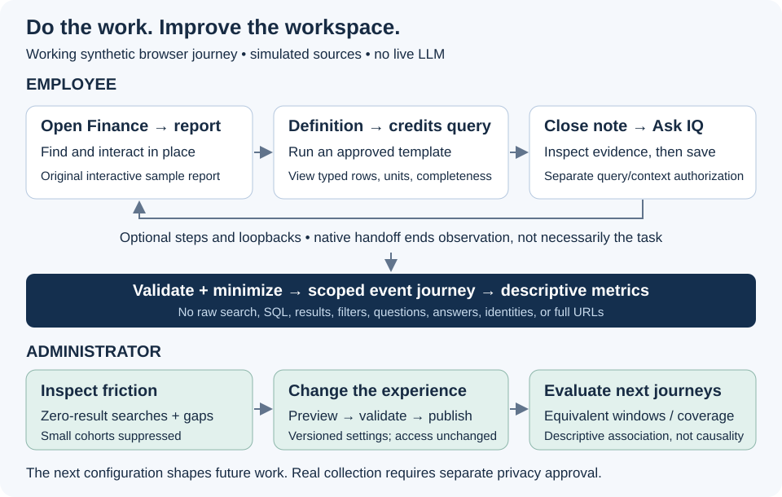

# Experience and customization

**Customize the experience. Understand the journey. Improve how people work.** Enterprise IQ's product direction lets an organization shape the workspace around employee tasks while preserving source access checks. The shared configuration resolver supports synthetic workspaces. The [interactive demo](demo-guide.md) now adds a settings screen, local draft/preview/publish/restore, and actual workspace presentation changes. See [demo validation](demo-validation.md) for publication status.

## Shape the workspace around the work

The default employee navigation is **Home · Reports · Data Explorer · Knowledge · Ask IQ · My Workspace**. Experience Settings and Usage Analytics belong in a separately authorized administrative area. Renaming Reports to Sales scorecards changes its label, not its permissions.

| Configurable area | Intended employee benefit | Local reference |
| --- | --- | --- |
| Organization brand, approved theme tokens, navigation labels/order | A familiar, accessible starting point | Plain labels, three accent tokens, two density options, known module IDs |
| Team landing page, curated reports, default report, contextual documents | Begin with the work relevant to the department | Different Finance and Sales fixtures |
| Report panels, permitted actions, saved-view defaults, Data Explorer | Keep useful tools near the report without crowding it | Allowlisted panel/action IDs, semantic view defaults, visibility setting |
| Individual favorites and layout | Resume an investigation in a preferred arrangement | Personal preferences constrained by locks and current access projection |

In the proposed report workspace, the report has the primary surface. Definitions, documentation, freshness and Ask IQ open on demand; an expand/fullscreen action restores space for the report. Labels and navigation must remain keyboard accessible. Source-supported interactions remain inside the report. Loading, denied, expired-session, unavailable and unsupported states need distinct explanations and recovery actions. The browser demo implements local filters, report pages, focus view, and on-demand context with original React reports. Live vendor embeds and their session recovery remain integration work.

The shell and source embed are separate customization layers. A shell panel setting or `savedViewDefault: 'summary'` is an application preference, not a promise that an arbitrary report exposes that view or accepts every style/action. An adapter must validate supported capabilities and permissions; see the [source adapter boundaries](source-adapters.md). Native-open remains an explicit fallback where the requested in-platform task is unsupported.

## Two synthetic departments

| Setting | Finance | Sales |
| --- | --- | --- |
| Landing/default report | Reports / Finance close | Home / Sales performance |
| Curated reports | Finance close and Sales performance | Sales performance |
| Contextual documentation | Revenue definition and close note | Revenue definition |
| Data Explorer | Visible for permitted credit investigation | Disabled and locked by the team |
| Report panels | Definitions, documentation, freshness, Ask IQ | Definitions and freshness |
| View/layout | Summary, report first | Detail, balanced |

Both people can save permitted favorites and use compact density. The Sales fixture has no access projection for the Finance report or close note. Choosing their identifiers in personal preferences does not make them visible. The [walkthrough](walkthrough.md) connects these settings to the existing synthetic revenue investigation.

## Resolver contract and decisions

[`resolveExperience(input)`](../examples/experience-configuration.mjs) accepts `organization`, `team`, `individual`, and `access`. [`makeExperienceFixture(department)`](../examples/experience-fixtures.mjs) supplies independent `finance` or `sales` data. Each layer has a version and settings; organization and team layers also declare locks. Organization settings are complete; later layers may be partial.

1. Validate every supplied layer, including values that a lock would otherwise ignore. Unknown settings/modules, duplicate lists, malformed values, markup labels and unsafe routes return `status: 'invalid'` with safe error codes. No partial configuration is emitted.
2. Apply organization → team → individual. Each setting is atomic: a navigation or favorites array replaces the preceding array rather than merging items. An earlier lock wins. Later conflicting values produce a conflict record naming the setting and layers, never the attempted value. A layer may lock only settings it supplies; individuals cannot declare locks.
3. Apply the separately supplied synthetic access projection. Remove unavailable modules, actions and resources; remove Data Explorer from navigation when disabled; choose the first remaining navigation item if the selected landing page is unavailable, or `null` if none remain. Access restrictions also apply to locked preferences.
4. Return `effective`, per-setting `provenance`, `conflicts`, and `experience_config_version`. Provenance identifies the winning layer/version, any lock, and any subsequent restriction. The version hashes canonical effective settings, provenance and layer versions; object key ordering cannot change it. It is a reproducible reference identifier, not a signature or access token.

This example accepts only fixed theme tokens and local application routes such as `/knowledge/getting-started`; arbitrary CSS, HTML, scripts, external URLs, queries and fragments are unsupported. Source references are opaque fixture IDs. Administration modules, identity, policy and permission grants are not valid preferences.

`access` simulates a current server-owned projection; it is **not trusted browser input in a production design**. The example does not authenticate its caller or establish enterprise isolation. Re-run projection after access changes, and separately authorize every report opening, query, export, document retrieval and model-context assembly. A visible module, a favorite, a saved answer or an earlier effective configuration grants no source access. Rendering a report does not authorize its underlying data for a model.

## Experience feedback loop

[Open the full-resolution diagram](../diagrams/experience-feedback-loop.svg).

The [browser demo](demo-guide.md#customize-an-experience) implements local drafts, a distinct preview, publication, version history, and restoration as a new version. The standalone resolver implements deterministic resolution and validation; its tests also restore an earlier input snapshot and verify identical resolved output. Real administrative authorization, an organizational approval workflow, and shared server persistence remain production work. Browser-local publishing is a synthetic demonstration, not an enterprise control plane.

Carry only `experience_config_version` into the [sanitized journey event contract](journey-telemetry.md), not favorite IDs, labels or configuration payloads. An administrator could inspect aggregate zero-result searches, improve terminology or navigation, publish a version and compare later observed journeys. Exclude preview/test sessions, respect small-cohort limits and coverage differences, and describe before/after differences as associations rather than causal improvements.

Run `node --test tests/experience-configuration.test.mjs` for lock, validation, changed-access and versioning cases. The [example guide](../examples/README.md) connects the resolver to governed query results and sanitized journey events.
