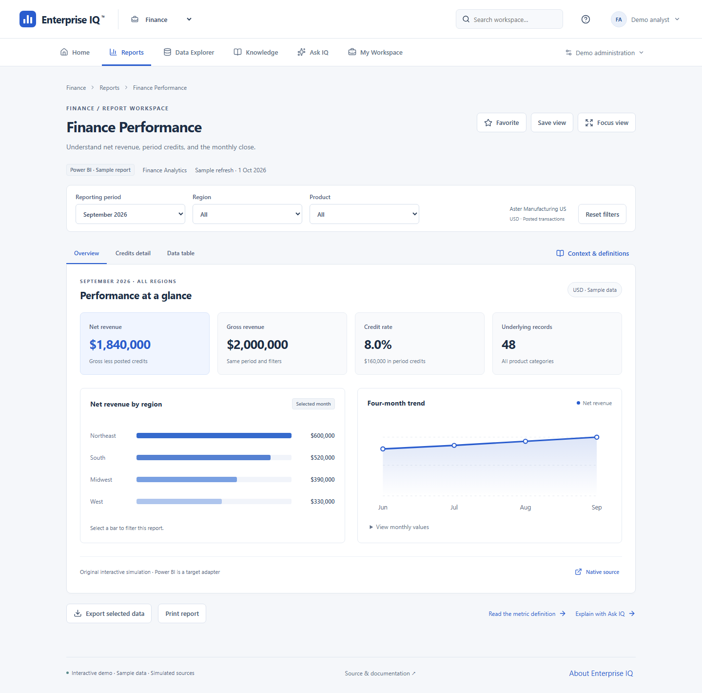
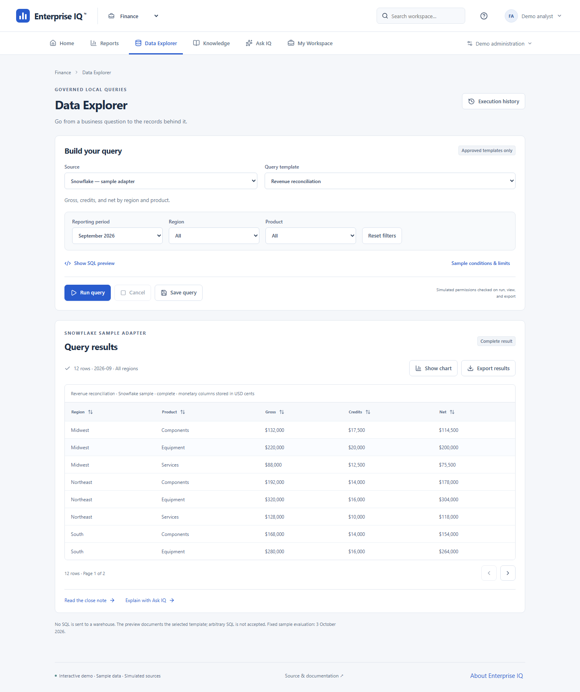
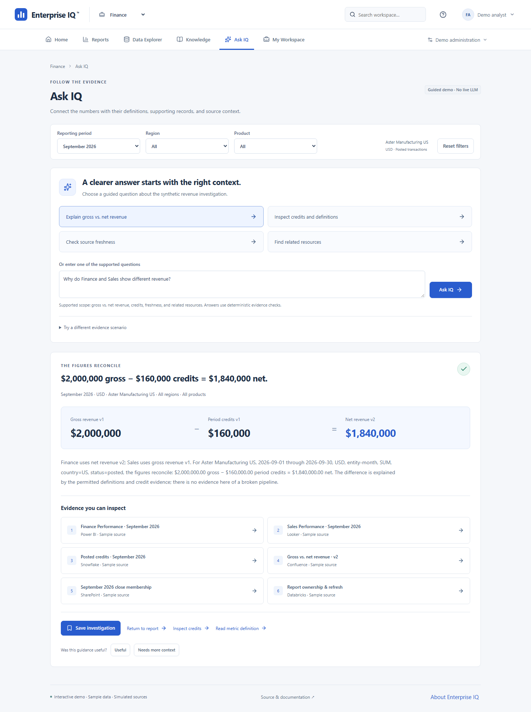
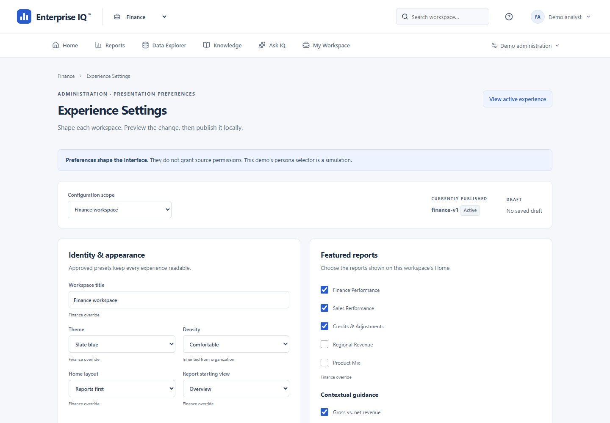
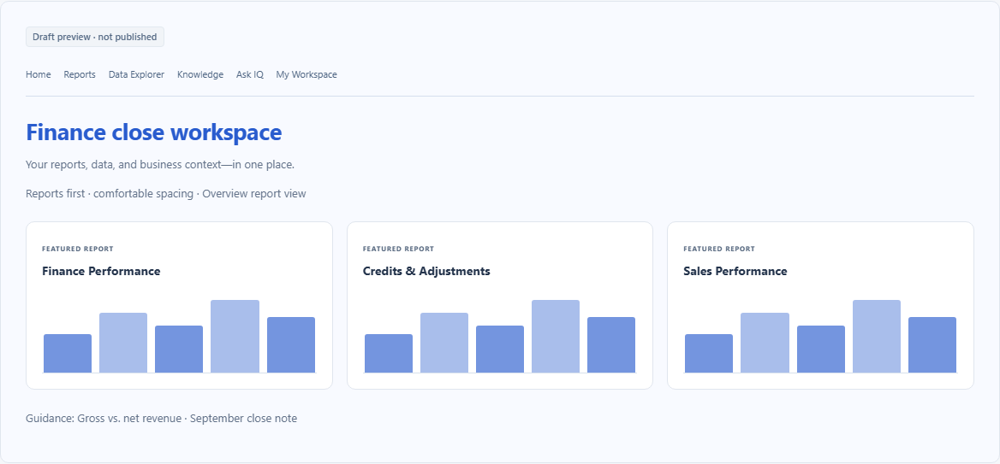
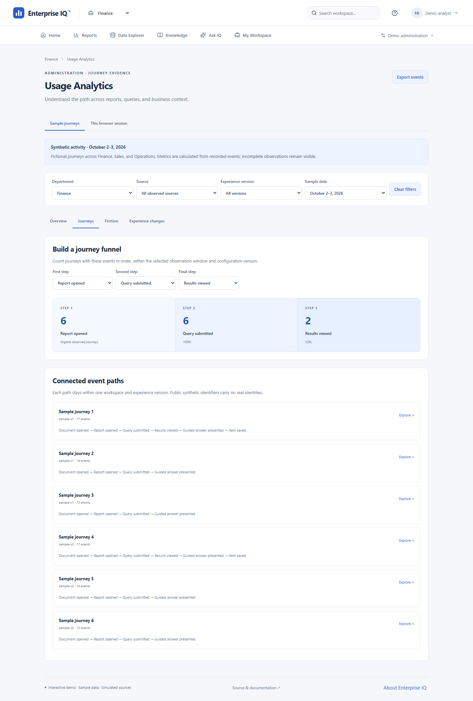
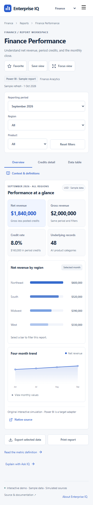

# Product gallery

[README](../README.md) · [Demo guide](demo-guide.md) · [Architecture](demo-architecture.md) · [Validation](demo-validation.md)

**Interactive reference demo · Sample data · Simulated sources**

These eight captures were taken from the verified local production build on **2026-10-05** in Chromium 153, using a 1440-pixel desktop viewport and a 390-pixel phone viewport. The phone capture is browser emulation. Every image was visually inspected. Select an image to inspect the full-resolution file. Captures show synthetic Aster Manufacturing records; they are not vendor embeds or generated interface pictures.

## Employee Home

Search, meaningful report previews, and the central revenue investigation share a task-oriented workspace.

## Interactive report

Finance Performance combines a shared reporting scope, computed measures, selectable regional bars, a four-month trend, and on-demand context.

## Governed query results

An approved reconciliation template computes typed rows from the same public fixture records. Viewing results is a separate action from completing execution.

## Guided explanation

Ask IQ reconciles permitted evidence and opens its cited sample sources. It is a deterministic guided experience with no live LLM.

## Experience Settings and draft preview

Settings expose workspace scopes, approved presets, featured content, provenance, and locks. The second capture is the actual preview region after saving a local draft; it does not show a published change.

## Journey analytics

The journey view calculates its funnel from synthetic events and retains optional paths. It does not infer employee productivity or causal improvement.

## Phone report

The report reflows into stacked charts and touch-friendly filters. Wide underlying tables scroll within their own surface.

To reproduce, build the app and start its production preview on port 4173. In another terminal, run `cd demo` and then `node e2e/capture-gallery.mjs`. Set `EIQ_BASE_URL` to use another verified build. The [validation record](demo-validation.md) identifies executed browser checks and release limits.
